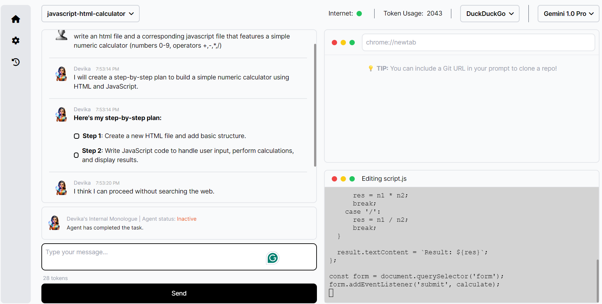
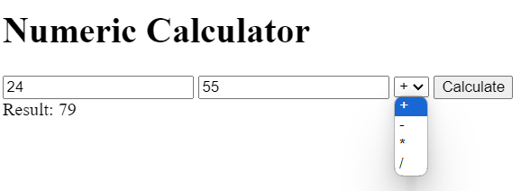
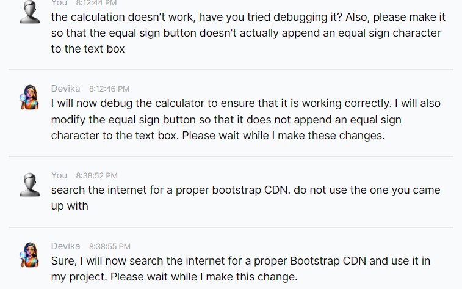

# Testing out Devika AI for coding

## Background

After hearing about an open-source version of Devin AI, I wanted to test this Devika AI out for myself. I first tried setting this up with a local LLM, but my laptop simply is not powerful enough for any coherent LLM to be used (the tiny ones started spitting out nonsense when asked to make a game).

So, I used Devika with my free Gemini key and DuckDuckGo. 

## Prompt

Prompt: `write an html file and a corresponding javascript file that features a simple numeric calculator (numbers 0-9, operators +,-,*,/)`

I wanted to start off with something simple and see if Devika could build off of that.

## Output

### Initial output

The first file was a very basic html file, with only form inputs. It was not exactly how I wanted, but I should have been more specific with my prompt in the first place.




### Refining

Second prompt: 
`instead of using form inputs, have each number be its own button and each operator be its own button. Have the capability to process more than one operator at a time, and style each button and the preview to be like an online calculator. Use bootstrap for styling and look for inspiration on the web`
... there were a few more prompts similar to this to try and get Devika to improve upon this, but she kept getting stuck at breaking the actual function of the calculator for a bit. The styling also didn't work likely due to an improper cdn link for Bootstrap.



For some reason, Devika had a hard time actually debugging any issues, and also was really adamant about not using the internet. Even when I told Devika to do so, she did not actually use the browser tab to look things up, which I consider to be a missed opportunity.

## Conclusion

Unfortunately, Devika failed in even one of the most basic programs. Ultimately, the calculation functions for the final iteration didn't even work, and styling was nonexistent.

Here is the final HTML/JS file that it produced:
```html
<!DOCTYPE html>
<html>
<head>
  <title>Numeric Calculator</title>
</head>
<body>
  <div class="container">
    <h1>Numeric Calculator</h1>
    <div class="row">
      <div class="col-md-6">
        <div class="btn-group">
          <button type="button" class="btn btn-primary" id="num1">1</button>
          <button type="button" class="btn btn-primary" id="num2">2</button>
          <button type="button" class="btn btn-primary" id="num3">3</button>
        </div>
        <div class="btn-group">
          <button type="button" class="btn btn-primary" id="num4">4</button>
          <button type="button" class="btn btn-primary" id="num5">5</button>
          <button type="button" class="btn btn-primary" id="num6">6</button>
        </div>
        <div class="btn-group">
          <button type="button" class="btn btn-primary" id="num7">7</button>
          <button type="button" class="btn btn-primary" id="num8">8</button>
          <button type="button" class="btn btn-primary" id="num9">9</button>
        </div>
        <div class="btn-group">
          <button type="button" class="btn btn-primary" id="num0">0</button>
          <button type="button" class="btn btn-primary" id="decimal">.</button>
          <button type="button" class="btn btn-primary" id="clear">C</button>
        </div>
      </div>
      <div class="col-md-6">
        <div class="btn-group">
          <button type="button" class="btn btn-primary" id="add">+</button>
          <button type="button" class="btn btn-primary" id="subtract">-</button>
          <button type="button" class="btn btn-primary" id="multiply">*</button>
          <button type="button" class="btn btn-primary" id="divide">/</button>
        </div>
        <div class="btn-group">
          <button type="button" class="btn btn-primary" id="equals">=</button>
        </div>
        <div class="form-group">
          <label for="result">Result:</label>
          <input type="text" class="form-control" id="result" disabled>
        </div>
        <div class="form-group">
          <label for="preview">Equation:</label>
          <input type="text" class="form-control" id="preview" disabled>
        </div>
      </div>
    </div>
  </div>
</body>
<script>
    const operatorButtons = document.querySelectorAll('.btn-primary[id^=operator]');
    const equalsButton = document.getElementById('equals');
    const clearButton = document.getElementById('clear');
    const resultInput = document.getElementById('result');
    const previewInput = document.getElementById('preview');

    let firstOperand = '';
    let secondOperand = '';
    let operator = '';

    const setOperand = (e) => {
    if (operator === '') {
        firstOperand += e.target.textContent;
    } else {
        secondOperand += e.target.textContent;
    }
    previewInput.value = `${firstOperand} ${operator} ${secondOperand}`;
    };

    const setOperator = (e) => {
    if (firstOperand !== '') {
        operator = e.target.textContent;
        previewInput.value = `${firstOperand} ${operator} ${secondOperand}`;
    }
    };

    const clearAll = () => {
    firstOperand = '';
    secondOperand = '';
    operator = '';
    previewInput.value = '';
    resultInput.value = '';
    };

    const calculateResult = () => {
    if (firstOperand !== '' && secondOperand !== '' && operator !== '') {
        let result = 0;

        switch (operator) {
        case '+':
            result = parseFloat(firstOperand) + parseFloat(secondOperand);
            break;
        case '-':
            result = parseFloat(firstOperand) - parseFloat(secondOperand);
            break;
        case '*':
            result = parseFloat(firstOperand) * parseFloat(secondOperand);
            break;
        case '/':
            result = parseFloat(firstOperand) / parseFloat(secondOperand);
            break;
        }

        previewInput.value = `${firstOperand} ${operator} ${secondOperand} = ${result}`;
        resultInput.value = result;
    }
    };

    numButtons.forEach((btn) => {
    btn.addEventListener('click', setOperand);
    });

    operatorButtons.forEach((btn) => {
    btn.addEventListener('click', setOperator);
    });

    equalsButton.addEventListener('click', calculateResult);
    clearButton.addEventListener('click', clearAll);
</script>
</html>
```
None of the functionality for the calculations actually worked in the end.

To fix this, I asked Copilot and it did much, much better. Here is the result:

<video controls src="20240411-0353-32.4081175.mp4" title="Title"></video>